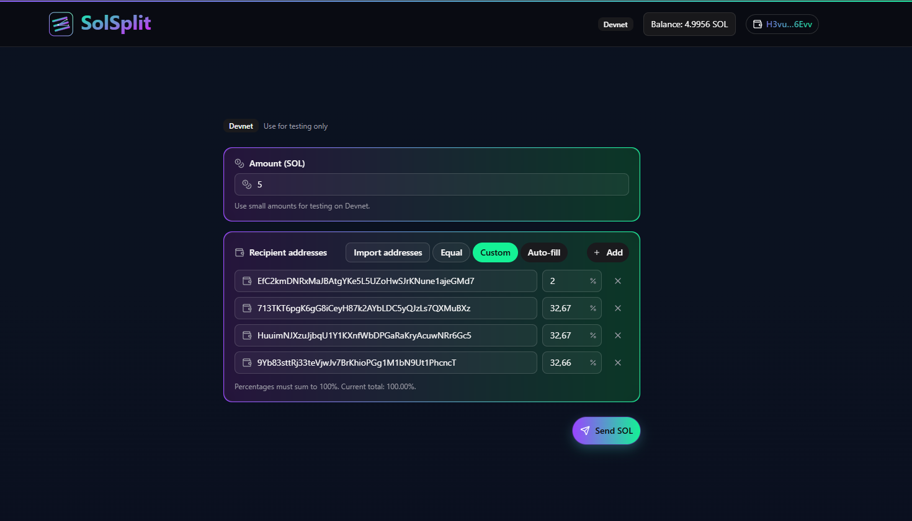
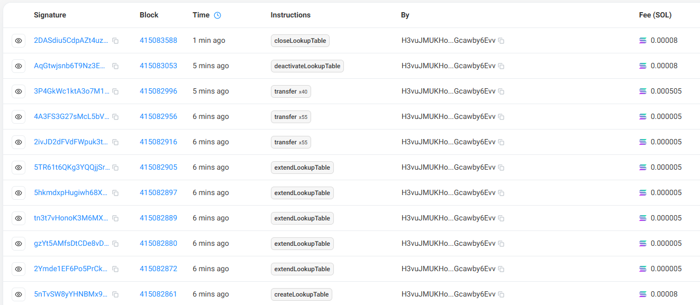

# SolSplit

SolSplit is a web app for sending SOL to multiple recipients efficiently and safely, using Address Lookup Tables (ALT) and v0 versioned transactions. It handles large recipient lists by extending ALT and sending transfers in batches to avoid exceeding message size limits and to provide a smooth signing experience.


 _SolSplit dashboard: main form with amount, recipients, Equal/Custom split, and send._

## Table of Contents
- [Overview](#overview)
- [Live App](#live-app)
- [Features](#features)
- [Requirements](#requirements)
- [Tech Stack](#tech-stack)
- [Installation & Scripts](#installation--scripts)
- [Quick Start](#quick-start)
- [Usage](#usage)
- [Transaction System](#transaction-system)
- [ALT Account Explained](#alt-account-explained)
- [Configuration & Tuning](#configuration--tuning)
- [Fee Estimation Strategy](#fee-estimation-strategy)
- [Troubleshooting](#troubleshooting)
- [Security & Best Practices](#security--best-practices)
- [Project Structure](#project-structure)
- [Development](#development)
- [Contributing](#contributing)
- [Explorer Link Status](#explorer-link-status)

## Overview
SolSplit streamlines multi‑send operations on Solana by:
- Creating a temporary ALT for large recipient sets.
- Extending the ALT in safe chunks.
- Sending high‑throughput batch transactions leveraging ALT lookups.
- Deactivating and (optionally) closing the ALT to reclaim rent.

## Live App
Visit the live deployment at: https://solsplit.casaislabs.com/

## Features
- Bulk address import without separators (auto tokenization by non‑base58 characters).
- Base58 validation; prevents empty, duplicate, or self addresses.
- Split amount evenly or by custom percentages (must total 100%).
- Temporary ALT for optimized v0 messages with many participants.
- Chunked ALT extension and chunked transfers to avoid oversized messages.
- Robust fee estimation with minimal‑message fallback when preflight hits RPC limits.
- Clear UI with informative toasts and per‑batch confirmation dialogs.
- ALT close panel after cool‑down to reclaim rent.

## Requirements
- Node.js 18+ and npm.
- Wallet: Phantom, Solflare, or Ledger (via `@solana/wallet-adapter`).
- Devnet connection (default in the provider).

## Tech Stack
- Build tooling: `Vite` + `@vitejs/plugin-react` (React Compiler), TypeScript `5.9`.
- Framework: `React 19` with hooks and strict mode.
- UI system: `shadcn/ui` (Radix UI primitives), `Tailwind CSS 4`, `lucide-react` icons, `next-themes` for theming.
- Solana SDK: `@solana/web3.js`, `@solana/wallet-adapter` (base, react, react-ui, wallets).
- Notifications: `sonner` toasts with batch and error feedback.
- Linting & quality: `ESLint 9` + `typescript-eslint`.
- Project patterns: typed utilities in `lib/`, reusable UI in `components/ui`, feature components under `components/transfer-form`, and custom hooks in `src/hooks` (`useSplit`, `useTxnDialog`, `useAltLifecycle`).

## Installation & Scripts
```bash
npm install
npm run dev      # start development (Vite)
npm run build    # build for production
npm run preview  # serve the build for verification
npm run lint     # lint the codebase with ESLint
```

## Quick Start
1) `npm install` and `npm run dev`.
2) Open `http://localhost:5173/` and connect your wallet.
3) Paste recipient addresses (auto tokenized), enter the amount, choose split mode, and send.

## Usage
- Equal split: divides the amount evenly and distributes any remainder in lamports.
- Custom split: enter percentages per recipient (must total 100%).
- Duplicates and self‑address are rejected.
- UI shows a dialog and toasts for each batch.

## Transaction System
A robust, practical flow ensures high throughput while respecting message size limits:


_Solscan capture: full transaction flow (create, extend, send, deactivate, close)._ 

1) Create a temporary ALT
- An empty ALT is created and owned by the sender for the current batch.

2) Extend ALT in chunks
- Unique recipient addresses are added in chunks of `CHUNK_SIZE` addresses per transaction (default: `30`).
- Chunking prevents oversized messages during extend operations.

3) Send in batches using the ALT
- Multiple transactions are built, each with up to `TRANSFER_CHUNK_SIZE` transfer instructions (default: `55`).
- ALT lookups keep v0 messages compact enough to serialize and pass preflight.
- Batches are sent sequentially; instructions within a transaction execute deterministically in order. The runtime may parallelize account processing internally, but transaction semantics remain ordered.

4) Deactivate the ALT
- After sending, the ALT is deactivated, starting the cool‑down period.

5) Close after cool‑down (optional)
- The ALT Close panel monitors remaining slots; when eligible, you can close to reclaim rent.

## ALT Account Explained
An Address Lookup Table (ALT) is a special on‑chain account introduced with Solana v0 messages that stores a list of addresses. A v0 transaction references this table to shorten messages, dramatically reducing bytes when many distinct accounts are involved.

- Purpose: compress address references via table lookups.
- Lifecycle: create → extend → use in v0 messages → deactivate → close.
- Cool‑down: after deactivation, a slot‑based cool‑down must elapse before closing.
- Ownership: only the ALT authority (your wallet) can extend/deactivate/close.

## Configuration & Tuning
- Network: `src/providers/SolanaProvider.tsx` sets `WalletAdapterNetwork.Devnet`.
- Chunk sizes:
  - `CHUNK_SIZE` (ALT extension): default `30`. Recommended: `20–40`.
  - `TRANSFER_CHUNK_SIZE` (SOL sends): default `55`. Recommended: `35–55`.
- If you see `encoding overruns Uint8Array` during fee estimation or send, lower the sizes (e.g., `40–45`) or split across more batches.

## Fee Estimation Strategy
To avoid failures from oversized preflight messages (`RangeError: encoding overruns Uint8Array`):
- Estimate per chunk with a normal v0 message when possible.
- Fall back to a minimal message for estimation when RPC limits are hit.
- If fallback fails, use a conservative default of `5000` lamports.
- This lets the app guard against insufficient balance without building huge preflight messages.

## Troubleshooting
- `encoding overruns Uint8Array` on send:
  - Lower `TRANSFER_CHUNK_SIZE` (e.g., `40–45`) or split across more transactions.
- `Fee estimation failed`:
  - Indicates fallback usage; sending may still work. Consider reducing chunk sizes if frequent.
- `Insufficient balance`:
  - Ensure funds cover total amount plus aggregated fees.
- User cancellation:
  - The UI shows friendly toasts when signing is rejected.

## Security & Best Practices
- Verify recipients before sending.
- Test on Devnet first with small amounts.
- With Ledger, blind signing may be required for transactions with many instructions.

## Project Structure
- Root
  - `index.html`: Vite entry.
  - `package.json`: scripts and dependencies.
  - `vite.config.ts`: Vite configuration.
  - `tsconfig*.json`: TypeScript configs.
  - `eslint.config.js`: ESLint config.
  - `components.json`: UI component configuration.

- `src/`
  - `main.tsx`: App bootstrap, providers, global toasters.
  - `App.tsx`: Top‑level layout composing header and main form.
  - `assets/`: Static assets (e.g., `logo.svg`).
  - `index.css`: TailwindCSS and theme styles.

  - Components
    - `SiteHeader.tsx`: Network badge, balance, wallet controls.
    - `BalanceDisplay.tsx`: Connection‑aware SOL balance.
    - `ConnectWalletButton.tsx`: Wallet connect/disconnect and actions.
    - `TransferForm.tsx`: Core multi‑send flow: validation, ALT create/extend, chunked send, deactivate, cleanup.
    - `transfer-form/AmountInput.tsx`: Amount field and validation.
    - `transfer-form/RecipientsSection.tsx`: Recipient management and previews.
    - `transfer-form/ImportAddressesButton.tsx`: Automatic address parsing and import.
    - `transfer-form/AltClosePanel.tsx`: ALT monitoring and closing.
    - `transfer-form/TxDialog.tsx`: Transaction progress dialog.

  - Hooks
    - `useSplit.ts`: Base58 validation, percent aggregation, lamport previews.
    - `useTxnDialog.ts`: Build, send, and confirm v0 transactions with optional ALT lookups.
    - `useAltLifecycle.ts`: Persist last ALT, monitor deactivation slots, enable closing.

  - Lib
    - `lib/fees.ts`: Fee estimation with minimal‑message fallback and balance assertion.
    - `lib/altStorage.ts`: Persist/restore ALT metadata (address, wallet, deactivation slot).
    - `lib/utils.ts`: Utility helpers (`cn`, etc.).

  - Providers
    - `providers/SolanaProvider.tsx`: Connection, wallet adapters, error toasts, commitment level (Devnet default).

  - UI
    - `components/ui/*`: Reusable UI primitives (button, dialog, label, separator, toaster, etc.).

## Development
### Local start
```bash
npm install
npm run dev
```
Visit `http://localhost:5173/` (Vite default port) and connect your dev wallet.

### Change network
Edit `src/providers/SolanaProvider.tsx` to adjust `WalletAdapterNetwork` and `clusterApiUrl`. Endpoints and RPC limits vary by network.

### Formatting & lint
- Run `npm run lint` before submitting changes.

## Contributing
PRs that improve performance, UX, or documentation are welcome. Please:
- Keep changes scoped and consistent with the current style.
- Document when you change defaults (e.g., chunk sizes).

## Explorer Link Status
Per request, the "View on Solana Explorer" link was removed from the UI. To verify transactions, use your wallet history or an external explorer by pasting the signature from your wallet (most wallets show recent activity with the signature).